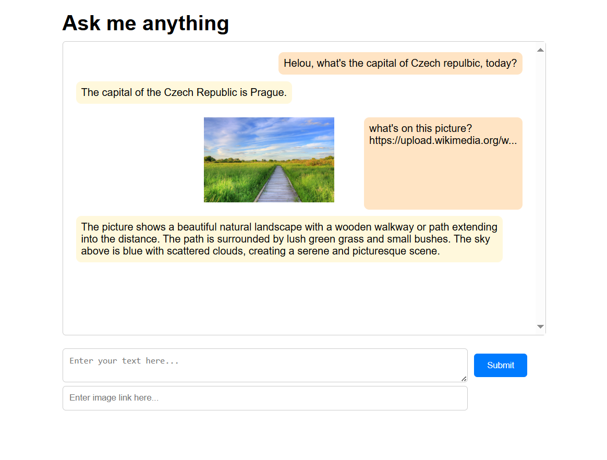

# openai demo Node.js

  

  Simple demo using Node.js and openai library.

## Install and run
First make sure, you have node installed.

Install with: 
`npm install`

Run with: 
`npm run start`

Site should be available at: `localhost:3000`

## Sources:

[Starting snippet for server-side Javascript request test](https://platform.openai.com/docs/quickstart?context=node)

